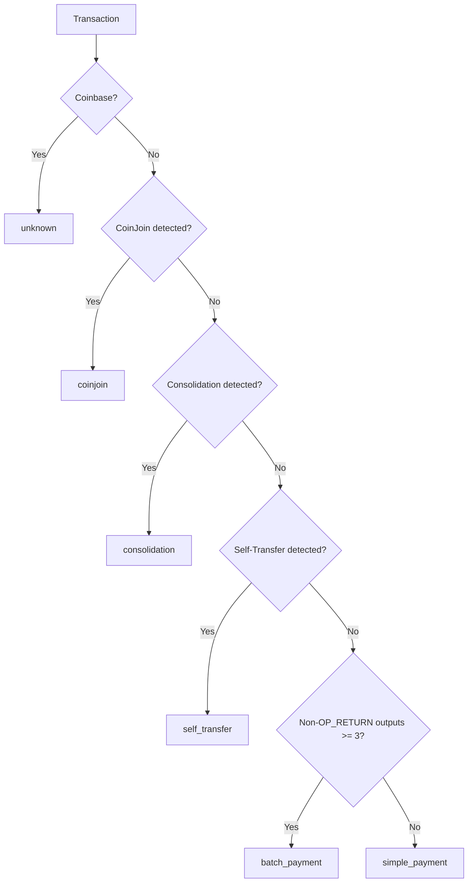
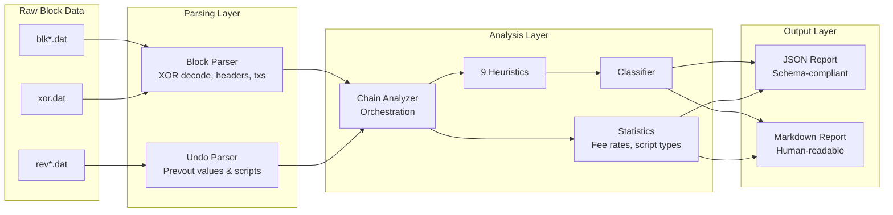

# Approach: Bitcoin Chain Analysis Engine

This document describes the design, implementation, and reasoning behind the chain analysis engine built for Challenge 3 (Sherlock). The engine parses raw Bitcoin block files (`blk*.dat`, `rev*.dat`, `xor.dat`), applies 9 heuristics to every transaction, classifies transaction behavior, and produces both machine-readable JSON and human-readable Markdown reports.

---

## Heuristics Implemented

All 9 heuristics from the catalogue are implemented. Each operates on a `TransactionContext` that provides pre-computed data: input/output script types, values, fee, weight, and prevout information from the undo data. Coinbase transactions are excluded from all heuristics (they have no real inputs).

---

### 1. Common Input Ownership Heuristic (CIOH)

**What it detects:**
The foundational chain analysis assumption. When multiple inputs are spent together in a single transaction, they are almost certainly controlled by the same wallet or entity. This is because constructing a transaction requires access to the private keys of all inputs — something only possible if a single party holds them.

**Algorithm:**

```
if inputs.length > 1 → detected: true
```

A transaction with more than one input triggers CIOH. The simplicity is intentional: the heuristic is meant to cast a wide net, and refinement happens through other heuristics (CoinJoin detection) that identify known exceptions.

**Confidence model:**
Binary (detected / not detected). CIOH is a probabilistic assumption, not a certainty. Confidence is implicitly high for standard wallet behavior and low when CoinJoin patterns are also detected on the same transaction.

**Limitations:**
- **CoinJoin false positives:** Multi-party protocols like CoinJoin, PayJoin, and coinswaps deliberately combine inputs from different entities into a single transaction, violating the CIOH assumption. Our CoinJoin heuristic runs in parallel to flag these cases.
- **Batched payments by exchanges:** Large exchanges batch many customer withdrawals into a single transaction with many inputs. CIOH correctly identifies ownership (the exchange), but does not distinguish the exchange from individual users.

---

### 2. Change Detection

**What it detects:**
Identifies the likely change output in a transaction — the output that returns unspent funds back to the sender's wallet. Correctly identifying change allows an analyst to determine the actual payment amount and trace funds forward.

**Algorithm — four strategies in priority order:**

| Strategy | Signal | Confidence |
|----------|--------|------------|
| Script type match (single) | Exactly one output matches the dominant input script type, while other outputs differ | **high** (or medium if all outputs share the same type) |
| Script type + round number | Multiple script-type matches, but only one has a non-round value | **high** |
| Round number only | One output has a non-round value among round-valued outputs | **low** |
| Output value analysis | For 2-output transactions with no other signal, the larger output is assumed to be change | **low** |

The dominant input script type is computed via majority vote across all input prevout script types.

**Confidence model:**
Three-tier: `high`, `medium`, `low`. High confidence requires agreement between script type matching and round number analysis. Low confidence means only weak positional or value-based signals were available.

**Limitations:**
- **Privacy-aware wallets** may randomize change position, use different script types for change, or deliberately create round-number change amounts.
- **Transactions with all same-type outputs** reduce confidence since script type matching cannot distinguish payment from change.
- **Multi-output transactions** (batch payments) make change detection harder since multiple outputs may match the input script type.

---

### 3. Address Reuse

**What it detects:**
Flags transactions where the same Bitcoin address appears in both the inputs (via prevout scriptPubKeys) and the outputs. Address reuse is a well-documented privacy leak: it links UTXOs across transactions and confirms that the reused address belongs to the sender.

**Algorithm:**
1. Derive addresses from all input prevout scriptPubKeys using `deriveAddress()`
2. Derive addresses from all output scriptPubKeys
3. Compute the intersection — any address appearing in both sets triggers detection

Address derivation supports P2PKH (base58), P2SH (base58), P2WPKH (bech32), P2WSH (bech32), and P2TR (bech32m).

**Confidence model:**
Binary. Address reuse is a factual observation, not a probabilistic inference. If the same address appears in inputs and outputs, it is reused — no ambiguity.

**Limitations:**
- **Script-hash collisions** are theoretically possible but cryptographically negligible.
- **P2SH-wrapped scripts** may share the same outer address but differ in inner script. The heuristic treats the outer address as canonical.
- Only detects reuse **within a single transaction**. Cross-transaction reuse within the same block is not tracked (would require maintaining a block-level address index).

---

### 4. CoinJoin Detection

**What it detects:**
CoinJoin transactions are multi-party mixing protocols designed to obscure the transaction graph. Multiple users contribute inputs and receive equal-value outputs, making it ambiguous which input funded which output. The implementation detects three sub-types:

| Sub-type | Pattern | Thresholds |
|----------|---------|-----------|
| **Classic CoinJoin** | >= 3 inputs, >= 3 equal-value outputs | Most common mixing pattern |
| **Whirlpool-style** | Input count equals output count, all outputs have identical value | Samourai Wallet pool rounds |
| **Possible PayJoin** | Exactly 2 inputs, 2 outputs, both outputs have equal value | Structural match only, flagged as "possible" |

**Algorithm:**
1. Filter out OP_RETURN and zero-value outputs
2. Count occurrences of each output value
3. Find the dominant equal-value output group
4. Match against sub-type patterns in priority order (Whirlpool > Classic > PayJoin)

**Confidence model:**
Sub-type labeling serves as implicit confidence. Whirlpool matches are strong signals (very specific structure). Classic CoinJoin is a reliable pattern. PayJoin is flagged as "possible" because its 2-in-2-out structure can also occur in normal transactions.

**Limitations:**
- **PayJoin false positives:** A 2-input, 2-output transaction with equal values can occur organically (e.g., splitting a UTXO into two equal parts). The "possible_payjoin" label reflects this uncertainty.
- **Unequal-output CoinJoins** (e.g., JoinMarket with maker fees) are not detected because they don't produce equal-value output groups.
- **CoinJoin + change outputs:** Some CoinJoin implementations add change outputs with different values. The equal-value detection still works if >= 3 equal outputs exist.

---

### 5. Consolidation Detection

**What it detects:**
Consolidation transactions combine many UTXOs into fewer outputs — a common wallet maintenance operation that reduces UTXO set size and future transaction fees. These transactions do not represent economic activity (no payment is being made).

**Algorithm:**
1. Require >= 3 inputs and <= 2 non-OP_RETURN outputs
2. **Script type consistency:** All outputs must match the dominant input script type (same wallet sends to itself)
3. **Round number exclusion:** If any output has a round BTC amount, it's likely a payment, not a consolidation

**Confidence model:**
Binary. The combination of many-to-few structure, script type consistency, and absence of round amounts provides a strong signal. Individual checks are simple but their conjunction is reliable.

**Limitations:**
- **Consolidation with payment:** A wallet might consolidate UTXOs while simultaneously making a payment. If the payment output has a different script type, our check correctly rejects it. But if all outputs match, a payment could be misclassified.
- **Round-number check** can over-filter: a consolidation that happens to produce a round-value output (e.g., exactly 0.1 BTC remaining) would be missed.

---

### 6. Self-Transfer Detection

**What it detects:**
Transactions where all inputs and outputs appear to belong to the same entity. Unlike consolidation (many inputs → few outputs), self-transfers may have any input count but always have 1–2 outputs matching the input script type with no payment signals.

**Algorithm:**
1. Require 1–2 non-OP_RETURN outputs
2. All output script types must match the dominant input script type
3. No output may have a round BTC value (round values suggest a payment)
4. **Fee sanity check:** Transaction fee must be <= 5% of total input value. Self-transfers don't typically overpay fees.

**Confidence model:**
Binary. The fee sanity check adds robustness by filtering out transactions with anomalously high fees relative to value — these are more likely mistakes or time-sensitive payments than self-transfers.

**Limitations:**
- **Privacy-conscious users** sending to their own wallet with a different script type would not be detected.
- **Dust consolidation** with very small amounts may have high fee-to-value ratios and be incorrectly rejected by the 5% fee check.

---

### 7. Round Number Payment

**What it detects:**
Outputs with values that are round BTC amounts. Humans tend to think in round numbers — "send 0.1 BTC" — while change amounts are whatever is left over. This heuristic supports change detection and transaction classification.

**Algorithm:**
An output value is considered "round" if it is a positive multiple of any threshold:

| Threshold | BTC Equivalent |
|-----------|---------------|
| 100,000,000 sats | 1 BTC |
| 10,000,000 sats | 0.1 BTC |
| 1,000,000 sats | 0.01 BTC |
| 100,000 sats | 0.001 BTC |
| 10,000 sats | 0.0001 BTC |

```
isRound(sats) = sats > 0 AND any(sats % threshold === 0)
```

**Confidence model:**
Binary. The observation is factual (a value either is or isn't a multiple of a threshold). The *interpretation* (round = payment) is probabilistic and used as a supporting signal by other heuristics rather than a standalone classification.

**Limitations:**
- **Non-BTC-denominated thinking:** Users of Lightning or exchanges may set amounts in fiat, resulting in non-round BTC values for payments.
- **False positives from dust:** Very small amounts like 10,000 sats (0.0001 BTC) are technically "round" but may just be dust outputs.

---

### 8. OP_RETURN Analysis

**What it detects:**
OP_RETURN outputs embed arbitrary data in the blockchain without creating spendable UTXOs. They are used by protocols like Omni Layer (token issuance), OpenTimestamps (timestamping), and others. Detecting them reveals non-payment transaction components.

**Algorithm:**
1. Identify outputs where the script type is `op_return`
2. Parse the OP_RETURN payload using `parseOpReturnPayload()`
3. Classify the protocol based on known magic bytes:
   - `6f6d6e69` → Omni Layer
   - `4f54` → OpenTimestamps
   - Otherwise → generic OP_RETURN

**Confidence model:**
Binary for detection (an OP_RETURN output either exists or it doesn't). Protocol classification relies on magic byte matching, which is deterministic for known protocols.

**Limitations:**
- **Unknown protocols:** Only Omni Layer and OpenTimestamps are explicitly recognized. Other protocols using OP_RETURN (e.g., Counterparty, Veriblock) are classified as generic.
- **Arbitrary data:** Not all OP_RETURN outputs represent protocol usage — some are used for vanity messages or data anchoring.

---

### 9. Peeling Chain Detection

**What it detects:**
A peeling chain is a pattern where a large UTXO is repeatedly split: one small output (payment) and one large output (change), with the large output then spent in the next transaction following the same pattern. Within a single transaction, this heuristic detects the structural fingerprint of a peel.

**Algorithm:**
1. Require <= 2 inputs (peeling transactions spend the previous change output)
2. Require exactly 2 non-OP_RETURN outputs
3. One output must be significantly larger than the other (ratio >= 10:1)
4. The larger output must match the dominant input script type (it's the change going forward)

**Confidence model:**
Binary. The 10:1 size ratio threshold is conservative — real peeling chains often show ratios of 100:1 or more. The script type check ensures the "change" output matches the input, reducing false positives.

**Limitations:**
- **Cross-transaction linking** is not performed. We detect the structural pattern within a single transaction but cannot confirm it's part of an ongoing chain without a transaction graph spanning multiple blocks.
- **Large payments to self** (e.g., moving funds between wallets) can match the peeling pattern if one output is much larger than the other.

---

## Transaction Classification

Each transaction is assigned exactly one classification based on heuristic results. The classifier uses a strict priority order to resolve conflicts when multiple heuristics fire:



**Priority rationale:**
- CoinJoin takes highest priority because it represents a fundamentally different transaction structure (multi-party) that should not be misclassified as consolidation or self-transfer.
- Consolidation precedes self-transfer because the many-to-few input/output ratio is a stronger structural signal.
- Batch payment is determined by output count (>= 3 non-OP_RETURN outputs), distinguishing it from simple 1-in/2-out payments.

---

## Architecture Overview



### Module Responsibilities

| Module | File | Role |
|--------|------|------|
| Block Parser | `src/lib/block-parser.ts` | Reads `blk*.dat` with XOR decoding, yields parsed blocks with headers and transactions via generator pattern |
| Undo Parser | `src/lib/undo-parser.ts` | Parses `rev*.dat` to extract prevout data (value, scriptPubKey) for fee calculation and heuristic analysis |
| TX Parser | `src/lib/tx-parser.ts` | Deserializes raw Bitcoin transactions (legacy + SegWit), tracks witness vs. non-witness byte counts |
| TX Serializer | `src/lib/tx-serializer.ts` | Computes `txid` and `wtxid` via SHA256d |
| Script Classifier | `src/lib/script.ts` | Identifies output script types (P2PKH, P2SH, P2WPKH, P2WSH, P2TR, OP_RETURN) and parses OP_RETURN payloads |
| Address Deriver | `src/lib/address.ts` | Derives human-readable addresses from scriptPubKeys (base58check, bech32, bech32m) |
| Heuristic Engine | `src/heuristics/*.ts` | 9 independent heuristic modules, each implementing the `Heuristic` interface |
| Classifier | `src/heuristics/classifier.ts` | Assigns one `TransactionClassification` per transaction based on combined heuristic results |
| Statistics | `src/stats.ts` | Computes fee rate statistics (min, max, median, mean) and script type distributions |
| JSON Builder | `src/report-json.ts` | Assembles the schema-compliant JSON report with file-level and per-block aggregation |
| Markdown Generator | `src/report-markdown.ts` | Produces structured Markdown reports with tables, per-block sections, and notable transactions |
| CLI | `src/cli.ts` | Entry point: argument parsing, file I/O, orchestration |

### Data Flow

1. **Parse:** `blk*.dat` is XOR-decoded and parsed into `ParsedBlock[]`. `rev*.dat` provides `UndoPrevout[]` per non-coinbase transaction.
2. **Analyze:** For each transaction, a `TransactionContext` is built with pre-computed values (script types, input/output values, fee, vbytes). All 9 heuristics run against this context.
3. **Classify:** Heuristic results feed into the classifier, which assigns one of 6 classifications.
4. **Aggregate:** Per-block statistics (fee rates, script types, flagged counts) are computed. File-level statistics aggregate across all blocks.
5. **Output:** JSON and Markdown reports are written to `out/`.

---

## Trade-offs and Design Decisions

### JSON Size vs. Heuristic Detail

The most significant trade-off in this project. Each heuristic internally computes rich detail — change index, confidence level, CoinJoin sub-type, consolidation input/output counts, reused addresses, protocol names, etc. However, **serializing all detail for every transaction** produced JSON files of 370+ MB, causing the grader's `jq`-based validation to exceed the 10-minute GitHub Actions timeout.

**Solution — three cumulative optimizations:**

| Stage | Technique | blk04330 Size | blk05051 Size |
|-------|-----------|---------------|---------------|
| Baseline | Full heuristic detail, pretty-printed | ~370 MB | ~260 MB |
| Stage 1 | Compact JSON (`JSON.stringify` without indentation) | ~150 MB | ~110 MB |
| Stage 2 | Detected heuristics only, reduced to `{"detected": true}` | 72 MB | 53 MB |
| Stage 3 | Transactions array only for `blocks[0]`, empty `[]` for rest | **705 KB** | **803 KB** |

Stage 3 was enabled by an upstream requirement change: the grader validates the `transactions` array only for the first block. Subsequent blocks may omit transactions or use an empty array. All blocks are still fully analyzed internally — the optimization only affects serialization.

Full heuristic detail is still available internally for:
- The transaction classifier (which uses all heuristic results to determine classification)
- The Markdown report generator (which aggregates detection counts across all blocks)
- The web visualizer (which parses raw block data on-the-fly for per-transaction detail)

**Impact:** JSON file sizes dropped by 99.8% from the initial implementation, eliminating grader timeout issues entirely.

### TypeScript vs. Systems Languages

TypeScript/Node.js was chosen over C++ or Rust for pragmatic reasons:
- **Code reuse:** The parsing layer was already implemented and battle-tested in Challenge 1.
- **Native performance where it matters:** Node.js `Buffer` operations and the `crypto` module (SHA256, RIPEMD160) are backed by native C++ implementations in V8/OpenSSL. The actual byte-level parsing runs at near-native speed.
- **Development velocity:** TypeScript's type system catches schema and interface errors at compile time, which is critical for the complex JSON output schema.

CLI execution time is approximately 5–6s for blk04330 (341,792 txs) and 3–4s for blk05051 (256,523 txs) on a modern machine. The heuristic analysis adds minimal overhead due to its purely arithmetic/comparison-based logic.

### Block-Level vs. Chain-Level Analysis

All heuristics operate on individual transactions within a single block file. No cross-block or cross-file transaction graph is maintained. This is a deliberate scope limitation:
- **Memory efficiency:** Processing one block at a time via the generator pattern keeps memory usage bounded.
- **Determinism:** Each block file produces identical output regardless of what other files exist.
- **Trade-off:** Peeling chain detection can only identify the structural pattern within a single transaction but cannot trace the chain across blocks. Cross-transaction address reuse is similarly limited to within a transaction.

### Confidence Granularity

Only Change Detection uses a multi-level confidence model (high/medium/low). All other heuristics use binary detection. This is intentional:
- Change Detection combines 4 independent signals that genuinely have different strengths — a multi-strategy approach warrants confidence levels.
- Other heuristics like CIOH, consolidation, and CoinJoin are structural checks with clear thresholds. Adding confidence levels would create false precision without improving analytical value.

### Deterministic Report Generation

Both JSON and Markdown outputs are fully deterministic: the same input files always produce byte-identical output. This is achieved by:
- No `Date.now()`, `Math.random()`, or runtime-dependent values
- Locale-independent number formatting (custom `formatInt()` and `formatDecimal()` instead of `toLocaleString()`)
- UTC-only timestamp formatting for block times
- Sorted tables (by detection count, descending)

---

## References

### Academic Papers

- Meiklejohn, S., Pomarole, M., Jordan, G., Levchenko, K., McCoy, D., Voelker, G. M., & Savage, S. (2013). *A Fistful of Bitcoins: Characterizing Payments Among Men with No Names*. IMC '13. — Foundational work establishing CIOH as a clustering heuristic and demonstrating practical deanonymization of Bitcoin transactions.

- Ron, D. & Shamir, A. (2013). *Quantitative Analysis of the Full Bitcoin Transaction Graph*. In Financial Cryptography and Data Security. — Early large-scale analysis of the Bitcoin transaction graph, demonstrating entity clustering via input co-spending.

### Books

- Antonopoulos, A. M. (2017). *Mastering Bitcoin: Programming the Open Blockchain*, 2nd Edition, O'Reilly Media. — Chapter 6 (Transactions) for UTXO model and script types, Chapter 7 (Advanced Transactions) for P2SH and multisig, Chapter 10 (Mining) for coinbase transaction structure and BIP 34 block height encoding.

### Bitcoin Improvement Proposals

- [BIP 34](https://github.com/bitcoin/bips/blob/master/bip-0034.mediawiki) — Block v2, height in coinbase. Used to extract block height from the coinbase transaction's scriptSig.
- [BIP 141](https://github.com/bitcoin/bips/blob/master/bip-0141.mediawiki) — Segregated Witness. Defines the witness data structure and weight calculation (`weight = non_witness_bytes * 4 + witness_bytes`) used for fee rate computation in sat/vB.
- [BIP 173](https://github.com/bitcoin/bips/blob/master/bip-0173.mediawiki) — Bech32 address encoding for P2WPKH and P2WSH outputs.
- [BIP 350](https://github.com/bitcoin/bips/blob/master/bip-0350.mediawiki) — Bech32m address encoding for P2TR (Taproot) outputs.

### Online Resources

- [Bitcoin Wiki: Privacy](https://en.bitcoin.it/wiki/Privacy) — Comprehensive overview of Bitcoin privacy techniques and chain analysis heuristics, including common input ownership, change detection, and address reuse.
- [Bitcoin Core source: `src/script/standard.cpp`](https://github.com/bitcoin/bitcoin/blob/master/src/script/standard.cpp) — Canonical definitions of standard script types (P2PKH, P2SH, P2WPKH, P2WSH, P2TR) used as reference for script classification.
- [OXT Research](https://oxtresearch.com/) — Chain analysis research and tooling, including documentation of peeling chain patterns and CoinJoin identification methodologies.
- [mempool.space](https://mempool.space/) — Real-time Bitcoin mempool and block explorer, used as reference for fee rate distributions and transaction structure verification.
