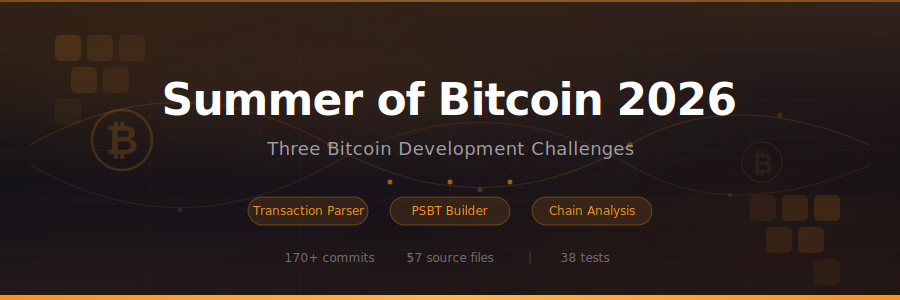

<p align="center">
  
</p>

<p align="center">
  <a href="https://summer-of-bitcoin-2026.vercel.app"><strong>Live Demo</strong></a> &nbsp;·&nbsp;
  <a href="#challenges">Challenges</a> &nbsp;·&nbsp;
  <a href="#tech-stack">Tech Stack</a> &nbsp;·&nbsp;
  <a href="#getting-started">Getting Started</a>
</p>

<p align="center">
  
  
  
  
</p>

---

Three Bitcoin development challenges completed as part of [Summer of Bitcoin](https://www.summerofbitcoin.org/) 2026 — a global open-source program that selects developers through protocol-level coding challenges before matching them with Bitcoin projects for a paid internship.

Each challenge was built from a specification: core logic as a CLI, comprehensive tests, and an interactive web visualizer. All three are unified into a single app, and every challenge directory preserves its complete git history.

## Challenges

### ₿ Chain Lens — Transaction Parser & Visualizer

> **Challenge 1** · 39 commits · [`challenge-1-chain-lens/`](./challenge-1-chain-lens/)

Parse raw Bitcoin transactions and blocks from hex into structured JSON. Classify every script type, compute fees and weights, detect timelocks, and explore the results through interactive flow graphs.

| Capability | Details |
|---|---|
| **Parsing** | Raw hex transactions with full SegWit & witness support |
| **Block mode** | Reads `blk.dat` / `rev.dat` / `xor.dat` files, iterates all blocks |
| **Script classification** | P2PKH, P2SH, P2WPKH, P2WSH, P2TR, OP_RETURN, Bare Multisig |
| **Visualization** | Interactive transaction flow graph (inputs → tx → outputs → fee) |

**Stack:** TypeScript · Next.js 16 · @xyflow/react · shadcn/ui

---

### ₿ Coin Smith — PSBT Transaction Builder

> **Challenge 2** · 44 commits · [`challenge-2-coin-smith/`](./challenge-2-coin-smith/)

Build safe, unsigned Bitcoin transactions from a set of UTXOs. Select coins with multiple strategies, estimate fees down to the vbyte, handle RBF and locktime, and export the result as a valid PSBT.

| Capability | Details |
|---|---|
| **Coin selection** | Branch-and-Bound (exact match), Largest-First, Lowest-Fee |
| **Fee estimation** | Per-input/output vbyte estimation with dust threshold detection |
| **RBF & Locktime** | Full sequence/locktime matrix per BIP 125 / BIP 68 |
| **Output** | PSBT Base64 export with strategy comparison and privacy meter |

**Stack:** TypeScript · Next.js 16 · bitcoinjs-lib · Vitest

---

### ₿ Sherlock — Chain Analysis Engine

> **Challenge 3** · 80 commits · [`challenge-3-sherlock/`](./challenge-3-sherlock/)

Analyze Bitcoin blocks with 9 chain-analysis heuristics. Classify every transaction, flag suspicious patterns, generate detailed reports, and explore results through charts, mosaics, and transaction flow graphs.

| Capability | Details |
|---|---|
| **9 heuristics** | CIOH, Change Detection, CoinJoin, Peeling Chain, Address Reuse, Round Number, Consolidation, Self-Transfer, OP_RETURN |
| **Classification** | `simple`, `batch`, `consolidation`, `coinjoin`, `self_transfer` |
| **Reports** | JSON + Markdown with per-block and per-file statistics |
| **Dashboard** | Charts, block mosaic, transaction explorer, flow graph modal |

**Stack:** TypeScript · Next.js 16 · Recharts · Vitest

---

## Tech Stack

| Layer | Technology |
|---|---|
| Language | TypeScript (strict mode) |
| Framework | Next.js 16 with App Router |
| UI | React 19, shadcn/ui, Tailwind CSS 4 |
| Visualization | @xyflow/react (flow graphs), Recharts (charts) |
| Bitcoin | bitcoinjs-lib, bech32, bs58check (protocol-level, no APIs) |
| Testing | Vitest with integration + unit tests |
| Deployment | Vercel |

## Architecture

```
summer-of-bitcoin-2026/
├── challenge-1-chain-lens/     # Full source + git history (subtree)
│   ├── src/                    # CLI: tx/block parser, analyzer
│   ├── tests/                  # Parser, script, block tests
│   └── web/                    # Original standalone web app
├── challenge-2-coin-smith/     # Full source + git history (subtree)
│   ├── src/                    # CLI: coin selection, PSBT builder
│   ├── tests/                  # Fee, validation, PSBT tests
│   └── web/                    # Original standalone web app
├── challenge-3-sherlock/       # Full source + git history (subtree)
│   ├── src/                    # CLI: 9 heuristics, chain analyzer
│   ├── test/                   # Unit + integration tests
│   └── web/                    # Original standalone web app
├── app/                        # Unified Next.js app
│   ├── page.tsx                # Landing page
│   ├── chain-lens/             # Challenge 1 interactive app
│   ├── coin-smith/             # Challenge 2 interactive app
│   ├── sherlock/               # Challenge 3 interactive app
│   └── api/                    # 17 namespaced API routes
├── components/                 # 83 ported UI components
└── lib/                        # Per-challenge web libraries
```

All three challenge directories were imported with `git subtree`, preserving every original commit. The unified app re-exports their core logic through path aliases and serves all three interactive web apps under a single deployment.

## Getting Started

```bash
git clone https://github.com/jorisstrakeljahn/summer-of-bitcoin-2026.git
cd summer-of-bitcoin-2026
npm install
npm run dev
```

Open [localhost:3000](http://localhost:3000) to see the landing page. Navigate to `/chain-lens`, `/coin-smith`, or `/sherlock` for the interactive apps.

## License

MIT

---

<p align="center">
  Built by <a href="https://github.com/jorisstrakeljahn">Joris Strakeljahn</a> · <a href="https://www.summerofbitcoin.org/">Summer of Bitcoin 2026</a>
</p>
